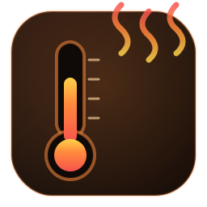
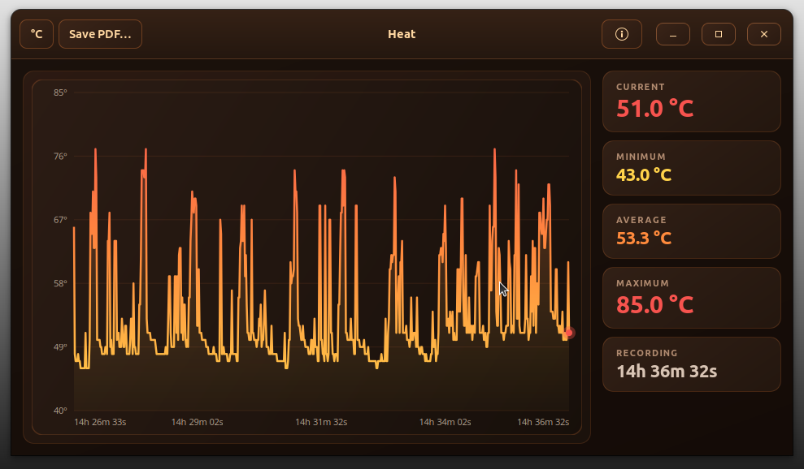

# Heat v1.0.1


A small GTK4 desktop app that watches your **CPU package temperature over
time**, draws a live heat‑gradient graph, and exports the recorded session to a
**PDF report** (per‑minute detail) via `pdflatex`.

It is a focused companion to the *Pulse* system monitor and reuses Pulse's
robust temperature‑reading logic (coretemp / k10temp / hwmon / thermal zones).



## Screenshot



## Features

- **Live graph** — the temperature over the session, drawn as a warm
  yellow→orange→red gradient line with grid and elapsed‑time axis.
- **Live stats** — current, minimum, average, maximum, and recording duration.
- **°C / °F** toggle (top‑left of the header bar).
- **Save PDF…** — exports a landscape PDF containing a summary, a per‑minute
  chart (average + maximum), and a per‑minute detail table. Built with
  `pdflatex` + `pgfplots`.
- **Taskbar / window icon** — a dedicated Heat icon installs into the hicolor
  theme and lights up the window and taskbar entry (via the `.desktop`
  `StartupWMClass` and matching `WM_CLASS`), exactly like Pulse.
- **System tray** — when a StatusNotifierItem tray is present, Heat shows a tray
  icon (left-click or "Show Heat" to restore, "Quit Heat" to exit). Closing or
  minimizing the window then hides it to the tray instead of quitting, so it
  keeps recording in the background. Where no tray is available the window
  behaves normally. Implemented over GDBus — no extra dependency.
- **Wide, low window** (1180×560 by default) that fits comfortably on a
  1366×768 display.

## Requirements

- GTK 4 (`libgtk-4-dev` to build)
- A C++17 compiler and `make`
- For PDF export: `pdflatex` with `pgfplots` — on Debian/Ubuntu:

  ```
  sudo apt-get install texlive-latex-base texlive-latex-recommended \
                       texlive-pictures texlive-latex-extra
  ```

## Build & run

```
make
./heat
```

## Install / uninstall

```
sudo make install      # binary, .desktop entry, and icons (hicolor)
sudo make uninstall
```

`make install` puts the binary in `/usr/local/bin`, the launcher in
`/usr/share/applications/heat.desktop`, and the icons in the hicolor theme, then
refreshes the icon cache and desktop database so the icon appears in menus, the
window title bar, and the taskbar.

## Notes

- Samples are taken once per second. The on‑screen graph shows the most recent
  ~600 samples; the PDF report covers the **entire** session, aggregated by
  minute.
- On PDF‑export failure the temporary build directory (with `pdflatex.log`) is
  left in place for inspection.

## Author

Jean-Francois Lachance-Caumartin

## License

MIT — see `LICENSE`.
